<p align="center">
  
</p>

A Neovim configuration built around the native LSP API, lazy.nvim and a test
suite that answers one question: is the config still intact?

Every plugin lives in its own module under `lua/plugins/`, grouped by purpose
rather than by name. Nothing is pinned by hand — `lazy-lock.json` does the
pinning — and the whole thing is checked by 197 automated assertions.

## Requirements

| Tool | Why |
|---|---|
| Neovim 0.12+ | the config uses `vim.lsp.config` and the treesitter `main` branch |
| git, curl | lazy.nvim bootstraps itself on first start |
| a C compiler | treesitter grammars are built locally |
| `tree-sitter` CLI 0.26.1+ | required by the treesitter rewrite, install from a package manager and **not** from npm |
| ripgrep, fd | telescope and grug-far |
| Nerd Font | icons; this config is used with Iosevka |

Language servers and formatters install themselves through Mason on first
start. Toolchains (Go, Rust, Elixir, Node) are expected to come from the system.

## Install

```sh
git clone <this repo> ~/.config/nvim
nvim
```

Everything else happens on its own: plugins, grammars, Mason packages.

## Languages

| Language | Server | Formatter | Tests |
|---|---|---|---|
| Elixir / HEEx | expert | `mix format` | neotest-elixir |
| Rust | rust_analyzer (via rustaceanvim) | rustfmt | rustaceanvim |
| Go | gopls | goimports + gofumpt | neotest-golang |
| TypeScript / JavaScript | ts_ls | prettierd | jest, vitest |
| Vue / Svelte | vue_ls, svelte | prettierd, LSP | — |
| SQL (PostgreSQL) | postgres_lsp | sql-formatter | — |
| Lua | lua_ls | stylua | — |
| Bash / Fish | bashls, fish_lsp | shfmt, fish_indent | — |
| JSON / YAML / TOML | jsonls, yamlls, taplo | prettierd, taplo | — |

## Plugins

48 in total, including lazy.nvim itself.

### Interface — `ui.lua`

| Plugin | What it does |
|---|---|
| [AlexvZyl/nordic.nvim](https://github.com/AlexvZyl/nordic.nvim) | Nord colorscheme; italics are dropped from `Delimiter` so `:` stays upright in code |
| [nvim-lualine/lualine.nvim](https://github.com/nvim-lualine/lualine.nvim) | status line, one for the whole editor |
| [Bekaboo/dropbar.nvim](https://github.com/Bekaboo/dropbar.nvim) | breadcrumbs in the winbar, driven by LSP symbols |
| [lukas-reineke/indent-blankline.nvim](https://github.com/lukas-reineke/indent-blankline.nvim) | indentation guides |
| [folke/noice.nvim](https://github.com/folke/noice.nvim) | rewrites the command line, messages and the LSP progress area |
| [rcarriga/nvim-notify](https://github.com/rcarriga/nvim-notify) | notification windows behind noice |
| [MunifTanjim/nui.nvim](https://github.com/MunifTanjim/nui.nvim) | UI primitives noice is built on |
| [nvim-mini/mini.icons](https://github.com/nvim-mini/mini.icons) | file-type icons |
| [nvim-tree/nvim-web-devicons](https://github.com/nvim-tree/nvim-web-devicons) | icon set other plugins still ask for by name |

### Files and search

| Module | Plugin | What it does |
|---|---|---|
| `editor.lua` | [stevearc/oil.nvim](https://github.com/stevearc/oil.nvim) | a directory as an editable buffer; also powers the `:Ssh` command over `oil-ssh://` |
| `telescope.lua` | [nvim-telescope/telescope.nvim](https://github.com/nvim-telescope/telescope.nvim) | fuzzy finder for files, grep, symbols, keymaps |
| `telescope.lua` | [nvim-telescope/telescope-fzf-native.nvim](https://github.com/nvim-telescope/telescope-fzf-native.nvim) | native fzf matcher, compiled on install |
| `telescope.lua` | [nvim-lua/plenary.nvim](https://github.com/nvim-lua/plenary.nvim) | the Lua standard library half the ecosystem depends on |
| `replace.lua` | [MagicDuck/grug-far.nvim](https://github.com/MagicDuck/grug-far.nvim) | project-wide search and replace with a live preview |
| `dashboard.lua` | [nvimdev/dashboard-nvim](https://github.com/nvimdev/dashboard-nvim) | start screen |

### Language support

| Module | Plugin | What it does |
|---|---|---|
| `lsp.lua` | [neovim/nvim-lspconfig](https://github.com/neovim/nvim-lspconfig) | server definitions; enabled through the native `vim.lsp` API, not `setup{}` |
| `lsp.lua` | [mason-org/mason.nvim](https://github.com/mason-org/mason.nvim) | installs servers and tools |
| `lsp.lua` | [mason-org/mason-lspconfig.nvim](https://github.com/mason-org/mason-lspconfig.nvim) | translates names between the two above |
| `lsp.lua` | [WhoIsSethDaniel/mason-tool-installer.nvim](https://github.com/WhoIsSethDaniel/mason-tool-installer.nvim) | keeps the declared package list installed |
| `lsp.lua` | [folke/lazydev.nvim](https://github.com/folke/lazydev.nvim) | teaches lua_ls the Neovim API and plugin modules |
| `lsp.lua` | [b0o/schemastore.nvim](https://github.com/b0o/schemastore.nvim) | JSON and YAML schema catalogue |
| `treesitter.lua` | [nvim-treesitter/nvim-treesitter](https://github.com/nvim-treesitter/nvim-treesitter) | 29 grammars; on the `main` branch highlighting is started per buffer by hand |
| `format.lua` | [stevearc/conform.nvim](https://github.com/stevearc/conform.nvim) | formatters on save, with `:FormatDisable` to turn it off |
| `rust.lua` | [mrcjkb/rustaceanvim](https://github.com/mrcjkb/rustaceanvim) | owns rust_analyzer; expands macros, runs tests, explains errors |

### Completion

| Plugin | What it does |
|---|---|
| [saghen/blink.cmp](https://github.com/saghen/blink.cmp) | completion engine; also publishes client capabilities the servers read on start |
| [rafamadriz/friendly-snippets](https://github.com/rafamadriz/friendly-snippets) | snippet collection |

### Git

| Plugin | What it does |
|---|---|
| [lewis6991/gitsigns.nvim](https://github.com/lewis6991/gitsigns.nvim) | hunk signs, staging from the buffer, inline blame |
| [kdheepak/lazygit.nvim](https://github.com/kdheepak/lazygit.nvim) | lazygit in a floating window |
| [esmuellert/codediff.nvim](https://github.com/esmuellert/codediff.nvim) | side-by-side diffs between revisions |

### Tests

| Plugin | What it does |
|---|---|
| [nvim-neotest/neotest](https://github.com/nvim-neotest/neotest) | run tests from the buffer, results in the sign column |
| [jfpedroza/neotest-elixir](https://github.com/jfpedroza/neotest-elixir) | `mix test` |
| [fredrikaverpil/neotest-golang](https://github.com/fredrikaverpil/neotest-golang) | `go test`, driven through gotestsum |
| [nvim-neotest/neotest-jest](https://github.com/nvim-neotest/neotest-jest) | Jest |
| [marilari88/neotest-vitest](https://github.com/marilari88/neotest-vitest) | Vitest |
| [nvim-neotest/nvim-nio](https://github.com/nvim-neotest/nvim-nio) | async primitives neotest runs on |

### Editing and motion

| Module | Plugin | What it does |
|---|---|---|
| `motions.lua` | [folke/flash.nvim](https://github.com/folke/flash.nvim) | jump anywhere on screen by typing two characters |
| `pairs.lua` | [windwp/nvim-autopairs](https://github.com/windwp/nvim-autopairs) | pairs brackets and quotes, treesitter-aware so `it's` stays intact |
| `yank.lua` | [gbprod/yanky.nvim](https://github.com/gbprod/yanky.nvim) | yank history that survives restarts |
| `yank.lua` | [kkharji/sqlite.lua](https://github.com/kkharji/sqlite.lua) | the storage behind that history |
| `illuminate.lua` | [RRethy/vim-illuminate](https://github.com/RRethy/vim-illuminate) | highlights other occurrences of the symbol under the cursor |
| `folds.lua` | [kevinhwang91/nvim-ufo](https://github.com/kevinhwang91/nvim-ufo) | folds built from LSP ranges |
| `folds.lua` | [kevinhwang91/promise-async](https://github.com/kevinhwang91/promise-async) | ufo's dependency |

### Windows, keys, diagnostics

| Module | Plugin | What it does |
|---|---|---|
| `windows.lua` | [mrjones2014/smart-splits.nvim](https://github.com/mrjones2014/smart-splits.nvim) | one set of keys moves between Neovim splits and zellij panes |
| `keys.lua` | [folke/which-key.nvim](https://github.com/folke/which-key.nvim) | shows what the pending key sequence can become |
| `trouble.lua` | [folke/trouble.nvim](https://github.com/folke/trouble.nvim) | a readable list for diagnostics, references and quickfix |
| `snacks.lua` | [folke/snacks.nvim](https://github.com/folke/snacks.nvim) | small utilities; the overlapping modules are deliberately off |
| `fun.lua` | [axsaucedo/neovim-power-mode](https://github.com/axsaucedo/neovim-power-mode) | screen shake while typing, no practical purpose whatsoever |
| — | [folke/lazy.nvim](https://github.com/folke/lazy.nvim) | the plugin manager itself |

## Keymaps

`<leader>` is <kbd>Space</kbd>. Press it and wait — which-key lists every group:
`c` code, `f` find, `g` git, `n` noice, `r` rust, `s` search & replace,
`t` test, `u` ui, `w` window, `x` diagnostics.

Window and pane movement is on <kbd>Ctrl</kbd> + `h/j/k/l` and crosses the
Neovim–zellij boundary without thinking about it.

## Tests

```sh
./tests/run.sh
```

197 assertions: stylua and lua-language-server first, then a headless Neovim
that creates throwaway projects per language and checks that servers attach,
formatters produce the expected bytes, grammars highlight, and the keymaps that
matter are still bound. Exit code 0 means the config is intact.

## Notes

- `lazy-lock.json` is committed on purpose — it is what makes a fresh clone
  reproducible.
- The config assumes zellij and reserves the keys zellij takes; every such
  decision carries a comment explaining itself.
- Cyrillic letters are mapped to `<Nop>` in normal, visual and operator-pending
  modes, so a Russian or Ukrainian layout produces silence instead of errors.
